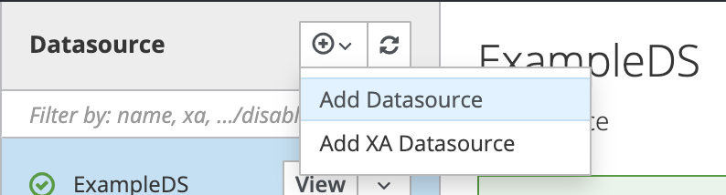
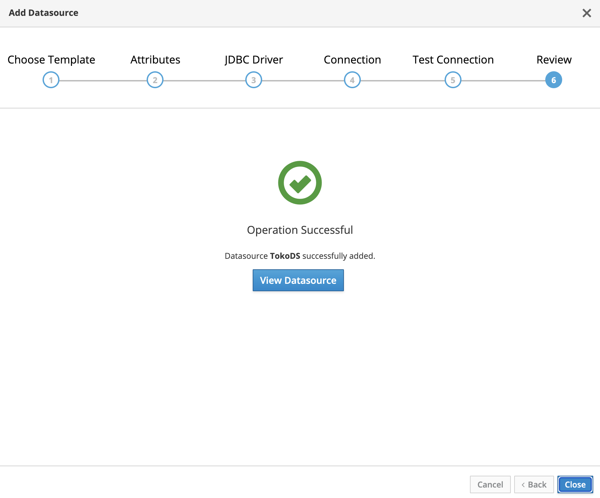

# Instalasi dan Konfigurasi JBoss EAP 7 #


## Mengaktifkan user admin ##

* Jalankan JBoss EAP

```
./bin/standalone.sh
```

* Enable admin user

```
./bin/add-user.sh
```

Outputnya sebagai berikut

```
What type of user do you wish to add? 
 a) Management User (mgmt-users.properties) 
 b) Application User (application-users.properties)
(a): a

Enter the details of the new user to add.
Using realm 'ManagementRealm' as discovered from the existing property files.
Username : admin
User 'admin' already exists and is disabled, would you like to... 
 a) Update the existing user password and roles 
 b) Enable the existing user 
 c) Type a new username
```

Update password untuk user admin

```
(a): a
Password recommendations are listed below. To modify these restrictions edit the add-user.properties configuration file.
 - The password should be different from the username
 - The password should not be one of the following restricted values {root, admin, administrator}
 - The password should contain at least 8 characters, 1 alphabetic character(s), 1 digit(s), 1 non-alphanumeric symbol(s)
Password : 
WFLYDM0098: The password should be different from the username
Are you sure you want to use the password entered yes/no? yes
Re-enter Password : 
What groups do you want this user to belong to? (Please enter a comma separated list, or leave blank for none)[PowerUser,BillingAdmin,]: 
Updated user 'admin' to file '/Users/endymuhardin/tmp/training-jee6/jboss-eap-7.4/standalone/configuration/mgmt-users.properties'
Updated user 'admin' to file '/Users/endymuhardin/tmp/training-jee6/jboss-eap-7.4/domain/configuration/mgmt-users.properties'
Updated user 'admin' with groups  to file '/Users/endymuhardin/tmp/training-jee6/jboss-eap-7.4/standalone/configuration/mgmt-groups.properties'
Updated user 'admin' with groups  to file '/Users/endymuhardin/tmp/training-jee6/jboss-eap-7.4/domain/configuration/mgmt-groups.properties'
Is this new user going to be used for one AS process to connect to another AS process? 
e.g. for a slave host controller connecting to the master or for a Remoting connection for server to server Jakarta Enterprise Beans calls.
yes/no? yes
To represent the user add the following to the server-identities definition <secret value="YWRtaW4=" />
```

* Browse ke management console : `http://localhost:9990/`

## Menambah Driver MySQL ##

1. Download MySQL JDBC Driver di [website resmi](https://dev.mysql.com/downloads/connector/j/). Pilih yang terbaru, versi 8, Platform Independent, tipenya Zip

[](img/download-mysql-driver.png)

2. Extract zip file tersebut sehingga kita mendapatkan file `jar`

[](img/extract-mysql-driver.png)

3. Jalankan JBoss CLI

    ```
    ./bin/jboss-cli.sh
    ```

4. Tambahkan modul MySQL Driver dengan perintah berikut

    ```
    [disconnected /] module add --name=com.mysql --resources=/Users/endymuhardin/tmp/training-jee6/mysql-connector-j-8.4.0/mysql-connector-j-8.4.0.jar --dependencies=javax.transaction.api,sun.jdk,ibm.jdk,javaee.api,javax.api
    ```

    Jangan lupa untuk mengganti opsi `resources` sesuai lokasi file jar di komputer masing-masing

5. Connect ke jboss yang sedang berjalan

    ```
    [disconnected /] connect
    [standalone@localhost:9990 /]
    ```

6. Register drivernya

    ```
    [standalone@localhost:9990 /] /subsystem=datasources/jdbc-driver=mysql:add(driver-name=mysql,driver-module-name=com.mysql,driver-xa-datasource-class-name=com.mysql.cj.jdbc.MysqlXADataSource, driver-class-name=com.mysql.cj.jdbc.Driver)
    ```

    Outputnya seperti ini

    ```json
    {"outcome" => "success"}
    ```

7. Cek ke web management console, pastikan drivernya sudah terlihat

[](img/mysql-driver-jboss.png)

## Menambah Datasource ##

1. Klik add datasource

[](img/01-add-datasource.png)

2. Pilih template konfigurasi MySQL

[](img/02-template-mysql.png)

3. Isikan nama datasource. Ini harus sama dengan yang di file `persistence.xml`

[](img/03-nama-ds.png)

4. Informasi driver database, sudah autodetect. Ikut saja defaultnya

[](img/04-info-driver.png)

5. Informasi koneksi database, sesuai konfigurasi database kita

[](img/05-info-koneksi.png)

6. Tes koneksi untuk memastikan konfigurasinya benar

[](img/06-tes-koneksi.png)

7. Koneksi sukses

[](img/07-koneksi-sukses.png)

8. Review konfigurasi

[](img/08-review-konfig.png)

9. Sukses menambah datasource

[](img/09-add-sukses.png)

10. Reload server

[](img/10-reload-server.png)

## Deployment Aplikasi ##

1. Build dulu aplikasinya

    ```
    mvn clean package
    ```

    Hasilnya adalah file `toko-ejb.jar` di folder `target`

2. Masuk ke menu Deployments di JBoss

3. Klik Upload Deployment

[](img/01-upload-deployment.png)

4. Masukkan file `toko-ejb.jar`

[](img/02-pilih-file-jar.png)

5. Tentukan nama deployment, ikuti default saja

[](img/03-nama-deployment.png)

6. Upload sukses

[](img/04-deploy-sukses.png)

7. Cek apakah skema database sudah berhasil generate

[](img/05-cek-hasil-deploy.png)